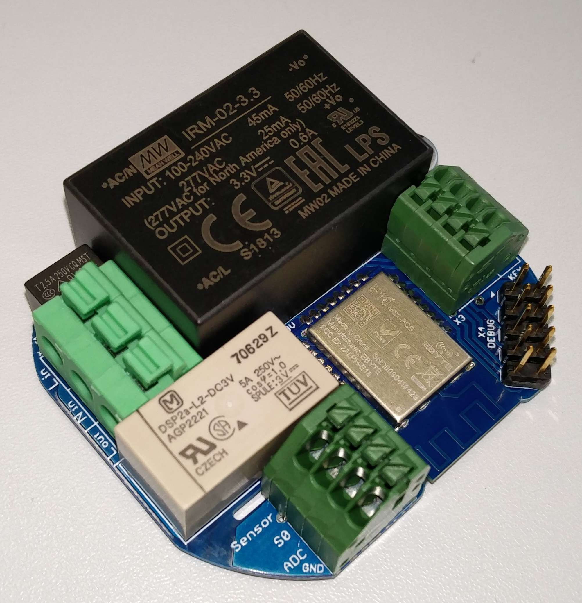
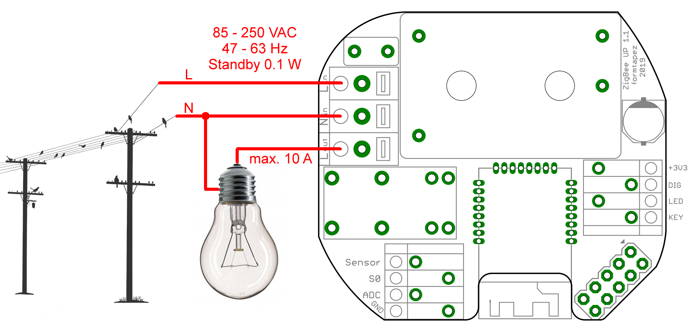
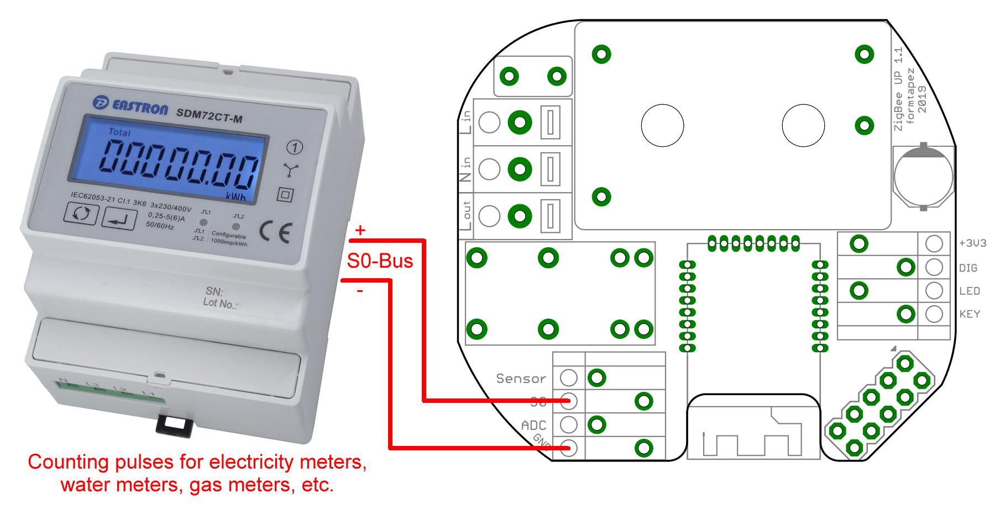
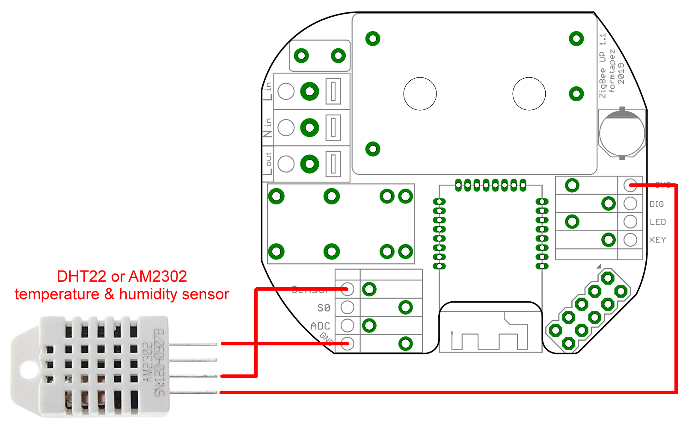
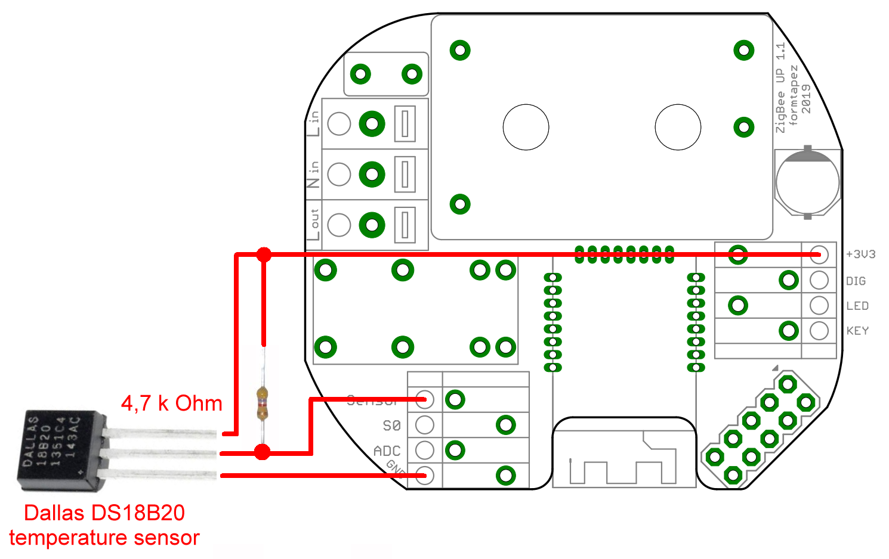
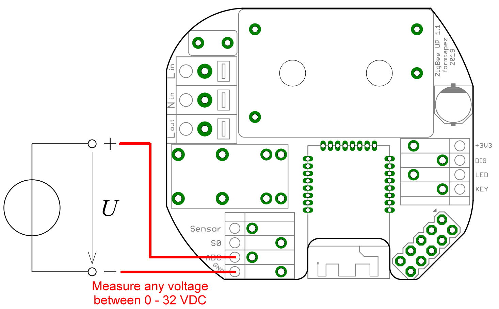
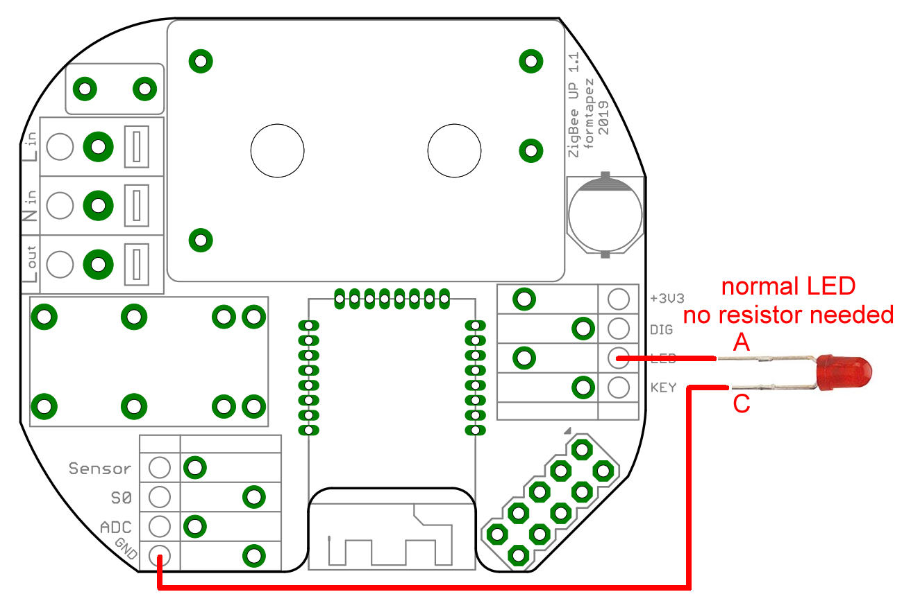
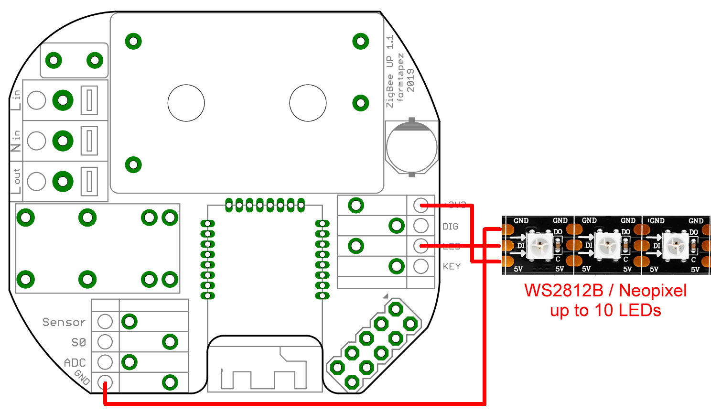

# ZigUP
CC2530 based multi-purpose ZigBee Relais, Switch, Sensor and Router

# Features

* Small enough to fit under a normal lightswitch in an european flush-mounted box ("Unterputzdose" - That´s the UP in ZigUP)
* integrated ZigBee Router (extends the range of all your other devices)
* Powerful bistable relais for up to 10 amps load
* 2 Inputs for switches/buttons:
	* Input "KEY" directly toggles the relais and outputs a ZigBee message
	* Input "DIG" only outputs a ZigBee message - So your coordinator can decide if the relais has to be toggled or not.
* Input for digital temperature and humidity sensors (DHT22/AM2302/DS18B20) (Measurements will be reported via ZigBee)
* Input for S0-Bus impulses from power-, water- or gas-meters. Count-Value will be reported via ZigBee)
* Output for one normal LED or up to 10 WS2812B/Neopixel RGB-LEDs (controllable via ZigBee)
* Analog input to measure voltages of up to 32 Volt. (Voltage will be reported via ZigBee)
* Fully equipped debug-port to allow CC Debugger flashing and packet sniffing

# Connection diagrams

# Compilation

1. Get **Z-Stack Home 1.2.2a.44539** from http://www.ti.com/tool/Z-STACK-ARCHIVE
2. Get **IAR Embedded Workbench for 8051** from https://www.iar.com/iar-embedded-workbench (you can use the free trial version for one month)
3. Clone ZigUP source to **\Projects\zstack\HomeAutomation\ZigUP\\**
4. Start **\ZigUP\CC2530DB\ZigUP.eww** to load project in IAR
5. Edit **\Projects\zstack\Tools\CC2530DB\f8wConfig.cfg** to use all 2.4 GHz channels:
	>-DDEFAULT_CHANLIST=0x07FFF800
6. Compile

# Flashing with CC Debugger
1. Get **SmartRF Flash Programmer v1.12.8 (not v2.x!)** from https://www.ti.com/tool/flash-programmer
2. Connect CC Debugger to the Debug-Port of ZigUP with an 1:1 cable.
3. Select "Program CCxxxx..." and "System-on-Chip" tab
4. Load HEX-File and perform "Erase, program and verify" action

# Packet Sniffing using CC Debugger
1. Get **PACKET-SNIFFER v2.18.1 (not SNIFFER-2 v1.x!)** from https://www.ti.com/tool/PACKET-SNIFFER
2. Connect CC Debugger to the Debug-Port of ZigUP with an 1:1 cable.
3. Select protocol "IEEE 802.15.4/ZigBee" and click "Start"
4. Change radio channel and click "Start"
5. Re-flash ZigUP firmware when you are done. Because it was replaced by a sniffer-firmware.
